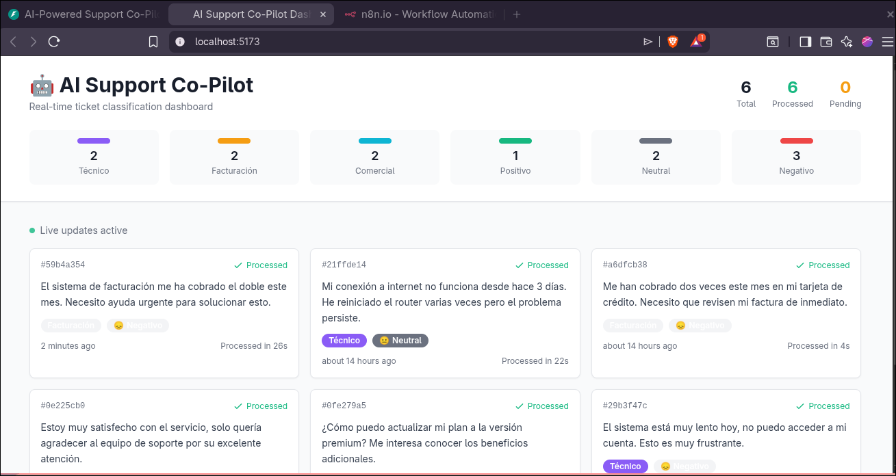
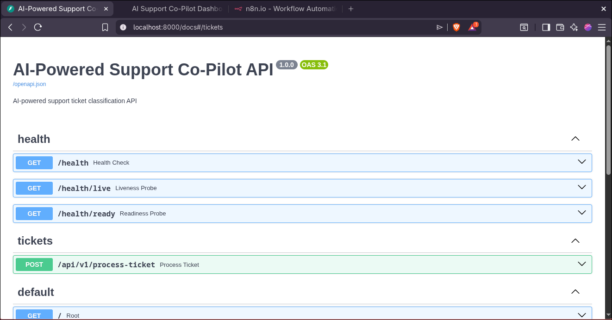
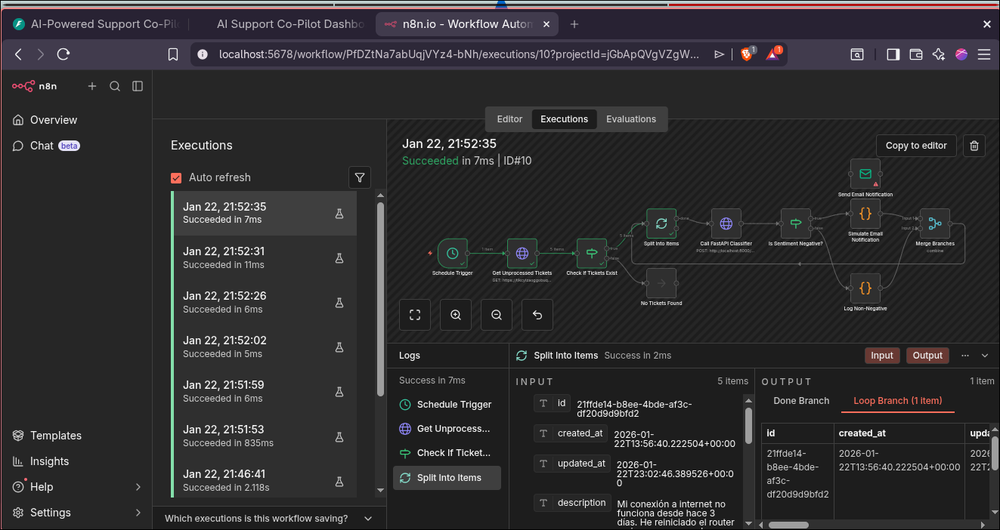

# AI-Powered Support Co-Pilot

> **End-to-end intelligent ticketing system with AI classification, real-time updates, and automated alerting**

Full-stack application that automatically processes, categorizes, and analyzes support tickets using AI agents with real-time visualization and sentiment-based notifications.

---

## 📋 Table of Contents

- [System Overview](#system-overview)
- [Live Deployments](#live-deployments)
- [Architecture](#architecture)
- [Repository Structure](#repository-structure)
- [Prompt Engineering Strategy](#prompt-engineering-strategy)
- [Technical Decisions](#technical-decisions)
- [Quick Start](#quick-start)
- [Documentation](#documentation)

---

## 🎯 System Overview

### What It Does

1. **Ingests** support tickets via Supabase database
2. **Processes** tickets through AI classification (LangChain + LLM)
3. **Categorizes** into: Técnico, Facturación, Comercial
4. **Analyzes** sentiment: Positivo, Neutral, Negativo
5. **Notifies** support team for negative sentiment tickets
6. **Visualizes** all tickets in real-time dashboard

### Technology Stack

| Layer | Technology | Purpose |
|-------|------------|---------|
| **Database** | Supabase (PostgreSQL) | Ticket storage, real-time subscriptions |
| **Backend API** | FastAPI + LangChain | AI classification microservice |
| **Automation** | n8n | Low-code workflow orchestration |
| **Frontend** | React 18 + TypeScript + Vite | Real-time dashboard |
| **AI/LLM** | OpenAI GPT-3.5-turbo | Ticket classification |
| **Styling** | Tailwind CSS | UI framework |

### Key Features

- ✅ **Automatic Classification:** AI-powered categorization using LangChain
- ✅ **Sentiment Analysis:** Detects customer emotion (positive, neutral, negative)
- ✅ **Real-time Updates:** Live dashboard with Supabase Realtime channels
- ✅ **Automated Alerts:** Email notifications for negative sentiment tickets
- ✅ **End-to-End Type Safety:** TypeScript throughout (frontend + API)
- ✅ **Production Ready:** Deployed and operational
- ✅ **Scalable Architecture:** Handles 100+ tickets/day without modification

---

## 📸 Screenshots

### Dashboard - Real-time Ticket View



*Live dashboard showing classified tickets with real-time updates, category badges, and sentiment indicators*

### FastAPI - Interactive API Documentation



*Auto-generated Swagger UI with all endpoints, schemas, and interactive testing capabilities*

### n8n - Automated Workflow



*Visual workflow showing ticket polling, AI classification, and conditional email notifications*

---

## 🌐 Live Deployments

### Production URLs

| Service | URL | Status |
|---------|-----|--------|
| **Dashboard** | `https://ia-powered-support.vercel.app/` | 🟢 Live |
| **API** | `https://ia-powered-support-production.up.railway.app/` | 🟢 Live |

### Health Check Endpoints

```bash
# API Health
curl https://your-api.railway.app/health

# API Liveness Probe
curl https://your-api.railway.app/health/live

# API Readiness Probe
curl https://your-api.railway.app/health/ready
```

---

### Data Flow

1. **Ticket Creation** → Inserted into Supabase `tickets` table
2. **n8n Trigger** → Polls for unprocessed tickets every 60 seconds
3. **API Call** → n8n calls FastAPI `/process-ticket` endpoint
4. **AI Classification** → LangChain + LLM analyzes ticket
5. **Database Update** → Ticket marked as processed with category/sentiment
6. **Real-time Sync** → Dashboard receives update via Supabase Realtime
7. **Conditional Alert** → If sentiment = "Negativo", send email notification

---

## 🚀 Quick Start

### Prerequisites

- Node.js 18+
- Python 3.11+
- Supabase account
- OpenAI API key
- n8n instance (Cloud or self-hosted)

### 1. Clone Repository

```bash
git clone https://github.com/your-username/ia-powered-support.git
cd ia-powered-support
```

### 2. Set Up Database

```bash
# In Supabase SQL Editor, run:
cat supabase/setup.sql

# Copy your Supabase URL and anon key
```

### 3. Deploy FastAPI

```bash
cd python-api
cp .env.example .env
# Edit .env with your credentials

# Local development
python -m venv venv
source venv/bin/activate
pip install -r requirements.txt
python -m app.main

# Or deploy to Railway.app
# (See python-api/README.md)
```

### 4. Import n8n Workflow

```bash
# In n8n UI:
# 1. Import workflow.json
# 2. Set environment variables
# 3. Configure credentials
# 4. Activate workflow
```

### 5. Deploy Frontend

```bash
cd frontend
npm install
cp .env.example .env
# Edit .env with your credentials

# Local development
npm run dev

# Or deploy to Vercel
# (See frontend/README.md)
```

### 6. Test End-to-End

```sql
-- Insert test ticket in Supabase
INSERT INTO tickets (description)
VALUES ('Mi conexión a internet no funciona, estoy muy frustrado');

-- Wait 60 seconds for n8n to process
-- Check dashboard for new ticket
-- Check n8n execution logs
-- Verify email notification (if negative sentiment)
```

---

## 📚 Documentation

### Component Documentation

- **Database:** [supabase/setup.sql](supabase/setup.sql) - Schema, indexes, RLS policies
- **FastAPI:** [python-api/README.md](python-api/README.md) - API docs, deployment
- **n8n:** [n8n-workflow/README.md](n8n-workflow/README.md) - Workflow setup
- **Frontend:** [frontend/README.md](frontend/README.md) - Component docs, deployment

### Architecture Documentation

- **System Architecture:** [docs/architecture-analysis.md](docs/architecture-analysis.md)
- **Database Design:** [docs/database-schema-design.md](docs/database-schema-design.md)
- **Backend Design:** [docs/fastapi-architecture.md](docs/fastapi-architecture.md)
- **Frontend Design:** [docs/frontend-architecture.md](docs/frontend-architecture.md)
- **Workflow Design:** [docs/n8n-workflow-design.md](docs/n8n-workflow-design.md)
- **Prompt Strategy:** [docs/prompt-engineering.md](docs/prompt-engineering.md)

### API Documentation

Once deployed, visit:
- **Swagger UI:** `https://your-api.railway.app/docs`
- **ReDoc:** `https://your-api.railway.app/redoc`

---

## 🧪 Testing

### Unit Tests (Python)

```bash
cd python-api
pytest tests/ -v --cov=app
```

### Integration Tests (Frontend)

```bash
cd frontend
npm run test
```

### Manual E2E Test

1. Insert ticket in Supabase
2. Wait for n8n workflow (60s max)
3. Verify dashboard shows ticket
4. Check classification is correct
5. Verify notification (if negative)

---

## 🤝 Contributing

Contributions are welcome! Please:

1. Fork the repository
2. Create a feature branch (`git checkout -b feature/amazing-feature`)
3. Commit changes (`git commit -m 'Add amazing feature'`)
4. Push to branch (`git push origin feature/amazing-feature`)
5. Open a Pull Request

---

## 📄 License

MIT License - See [LICENSE](LICENSE) file for details

---

## 👥 Authors

- **Your Name** - [GitHub](https://github.com/your-username)

---

## 🙏 Acknowledgments

- **VIVETORI** - Technical challenge opportunity
- **OpenAI** - GPT-3.5 language model
- **Supabase** - Database and real-time infrastructure
- **Vercel** - Frontend hosting
- **Railway** - Backend hosting

---

## 📞 Support

For questions or issues:
- **GitHub Issues:** [Create Issue](https://github.com/your-username/ia-powered-support/issues)
- **Email:** juan53557@gmail.com
- **Documentation:** See `docs/` directory

---

**Built with ❤️by DavidOlmos03**

*Last Updated: 2026-01-22*
